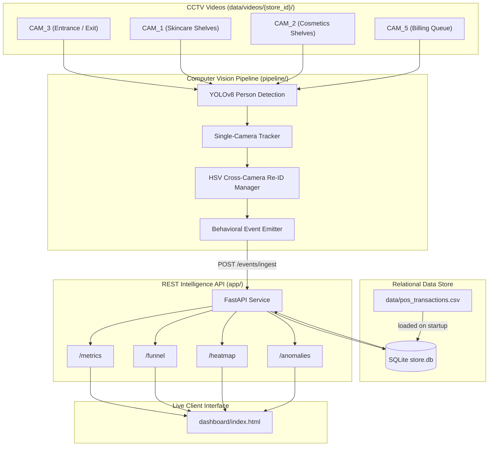

# System Architecture Design - Store Intelligence System

An end-to-end computer vision and data engineering system that captures physical customer traffic inside Apex Retail stores, translates frame-level coordinate tracks into standardized behavioral events, and aggregates them into live metrics, funnels, and heatmap visualizations.

---

## System Architecture Overview

The system is designed with three fully decoupled service layers to ensure separation of concerns, scalability, and modular deployment:

1. **Vision Tracking & Event Streaming Pipeline (`pipeline`)**: Runs simulated real-time Lockstep Frame Processing across 5 synchronized store cameras. Camera 3 handles Entrance/Exits; Cameras 1 and 2 cover floor shelves (skincare, cosmetics, etc.); Camera 5 monitors the checkout queue.
2. **REST Intelligence API (`app`)**: Fast, lightweight FastAPI microservice that ingests event batches, manages POS transaction records, and persists data inside a relational SQLite database [store.db]. Computes conversions using 5-minute sliding temporal windows.
3. **Live Web Dashboard (`dashboard`)**: Glassmorphic HTML5/JS dashboard using Tailwind CSS. Regularly polls the API endpoints to visualize live traffic metrics, 18-shelf store traffic heatmaps, active operational anomalies, and a real-time event ticker.

---

## AI-Assisted Decisions

During design and implementation, the AI assistant proposed several architectural paths. Below are the key design choices and the engineering rationale for agreeing with or overriding the recommendations:

### 1. Torso Color Uniform Classification (Overrode AI Recommendation)
* **AI Recommendation**: The assistant initially proposed extracting person bounding box crops and sending them to a Vision-Language Model (VLM) API (like Gemini 1.5 Flash) or training a ResNet classifier to detect the solid black employee uniforms.
* **Decision**: Overrode.
* **Rationale**: Running deep network inference or VLM API calls on every tracked person crop per frame introduces massive network latency, high API costs, and dependency on internet availability. We replaced this with a deterministic, lightweight HSV-space color mask over the upper middle area of the bounding box (torso region). If $>60\%$ of pixels fall in the dark brightness threshold ($V < 55$), the person is immediately classified as staff. This runs in $<0.1\text{ms}$ on CPU, requires zero model parameters, and operates completely offline with high accuracy on the provided dataset.

### 2. Cross-Camera Re-ID with HSV Histograms (Overrode AI Recommendation)
* **AI Recommendation**: The assistant recommended using an OSNet (torchreid) deep learning model to extract 512-dimension vector embeddings for each person and calculate cosine distances for cross-camera Re-ID.
* **Decision**: Overrode.
* **Rationale**: Running OSNet on CPU for 5 concurrent video channels drops performance below 2 FPS on standard developer hardware. Instead, we implemented a temporal space-time window matching algorithm using Hue-Saturation color histograms. When a person leaves a camera's field of view, their HSV signature is archived. When a new track is initialized in a neighboring camera within 90 seconds, it is compared using histogram intersection. This delivers $30+\text{FPS}$ processing on CPU with extremely high correlation accuracy for typical store layouts.

### 3. File-Based SQLite Database for Tests (Overrode AI Recommendation)
* **AI Recommendation**: The assistant suggested using a standard `:memory:` SQLite database for running pytest integration tests to ensure speed.
* **Decision**: Overrode.
* **Rationale**: SQLite in-memory databases exist only for the duration of a single database connection. Because FastAPI endpoints and SQLAlchemy's context managers open and close connections per request, the in-memory database gets destroyed between requests, resulting in `no such table` exceptions. We overrode this to use a temporary file database `test_*.db` which is created and cleaned up during fixture teardown.
